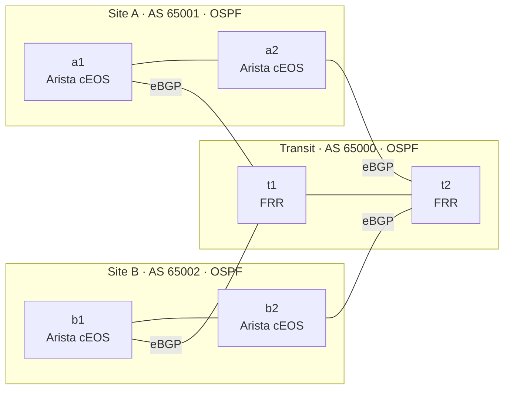
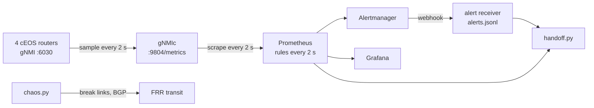

# NetPulse

A 6-router OSPF/BGP lab, defined as code, that watches itself: gNMI telemetry into
Prometheus and Grafana, alerts linked to runbooks, a chaos runner that measures
time-to-alert, and an auto-generated shift-handoff report.


<!--   (uncomment once docs/demo.gif exists) -->

## Results

<!-- Copy every number from results/summary.json. Never from memory or the prediction. -->

| Failure | Predicted median | Measured median | p95 | Detected |
| --- | --- | --- | --- | --- |
| Link down | ~3 s | [ ] s | [ ] s | [ ]/20 |
| BGP session shutdown | ~3 s | [ ] s | [ ] s | [ ]/20 |
| Silent packet loss (3 s hold timer) | ~5–6 s | [ ] s | [ ] s | [ ]/20 |

[N] injected failures on a MacBook Air (Apple silicon, OrbStack), [date]. See [Method](#method).
Raw data: [`results/runs.csv`](results/runs.csv), [`results/summary.json`](results/summary.json).
Sample report: [`docs/sample-handoff.md`](docs/sample-handoff.md).

## Architecture





The transit routers are deliberately unmonitored: in real networks you get no telemetry from your
provider, so their failures have to be detected from your own side. That's what the lab measures.

### Design plan

| Router | Role | NOS | AS | Loopback0 | Mgmt IP |
| --- | --- | --- | --- | --- | --- |
| a1 | Site A edge | Arista cEOS 4.36.2F | 65001 | 10.255.1.1/32 | 172.20.20.11 |
| a2 | Site A edge | Arista cEOS 4.36.2F | 65001 | 10.255.1.2/32 | 172.20.20.12 |
| b1 | Site B edge | Arista cEOS 4.36.2F | 65002 | 10.255.2.1/32 | 172.20.20.21 |
| b2 | Site B edge | Arista cEOS 4.36.2F | 65002 | 10.255.2.2/32 | 172.20.20.22 |
| t1 | Transit | FRR 10.7.1 | 65000 | 10.255.0.1/32 | 172.20.20.31 |
| t2 | Transit | FRR 10.7.1 | 65000 | 10.255.0.2/32 | 172.20.20.32 |

| # | Side A | Side B | Subnet | Runs |
| --- | --- | --- | --- | --- |
| 1 | a1 eth1 .0 | a2 eth1 .1 | 10.0.1.0/31 | OSPF area 0 |
| 2 | b1 eth1 .0 | b2 eth1 .1 | 10.0.2.0/31 | OSPF area 0 |
| 3 | t1 eth3 .0 | t2 eth3 .1 | 10.0.3.0/31 | OSPF area 0 |
| 4 | a1 eth2 .0 | t1 eth1 .1 | 10.0.4.0/31 | eBGP 65001–65000 |
| 5 | a2 eth2 .0 | t2 eth1 .1 | 10.0.5.0/31 | eBGP 65001–65000 |
| 6 | b1 eth2 .0 | t1 eth2 .1 | 10.0.6.0/31 | eBGP 65002–65000 |
| 7 | b2 eth2 .0 | t2 eth2 .1 | 10.0.7.0/31 | eBGP 65002–65000 |

- OSPF inside each site and inside transit carries loopbacks, so iBGP peers loopback-to-loopback
  with `next-hop-self`.
- 7 BGP sessions in total (4 eBGP, 3 iBGP). The four cEOS routers see **8 session endpoints**
  (2 each), which is what the alerts and `chaos.py` check.
- Each site advertises its loopbacks plus a site prefix (192.168.1.0/24, 192.168.2.0/24).

| Setting | Value | Why |
| --- | --- | --- |
| BGP keepalive / hold | 1 s / 3 s | Silent failure caught in 3 s instead of the 180 s default |
| OSPF hello / dead (p2p) | 1 s / 4 s | Fast adjacency loss, no DR election |
| gNMI sample interval | 2 s | Predictable worst case |
| Prometheus scrape / eval | 2 s / 2 s | Matches the sample rate |
| Alert `for:` | 0 s | Fire on the first bad sample (lab measurement only) |
| Alertmanager `group_wait` | 0 s | The 30 s default would pollute every measurement |

**Predicted latency:** t_alert = t_detect + Δsample + Δscrape + Δeval + Δnotify. Each 2 s wait
averages ~1 s, so ~3 s median (worst ~6 s) when the router notices instantly; add ~2–3 s for silent
loss, where the 3 s hold timer has to expire first.

## Run it

Needs an Apple silicon Mac with OrbStack, an Ubuntu machine with containerlab 0.79, and the
`cEOSarm-lab-4.36.2F` image imported as `ceos:4.36.2F`.

```bash
make deploy          # 6 routers + gNMIc, Prometheus, Alertmanager, Grafana, receiver
open http://localhost:3000   # Grafana, dashboard "NetPulse"
make chaos-smoke     # 2 real failures, sanity check
make chaos           # 60 failures, ~40 min
make handoff         # shift-handoff report from alert history
make test            # ruff + pytest
```

## Method

1. `t0` is stamped immediately before the failure is injected; `received_at` is stamped the moment
   the webhook arrives. Both clocks are the same Linux kernel (containers share it), so there is no skew.
2. An alert counts only if it names the exact router plus interface or BGP neighbor that was broken.
3. Timeouts stay in the data as undetected runs.
4. Every run starts from full health: nothing firing and all 8 sessions Established.
5. Raw evidence is committed: `results/runs.csv` and `results/summary.json`.

## Tests

- `pytest`: percentile math, alert matching, half-written log lines, handoff pairing, and a
  cross-check of every router config against the design plan.
- `promtool test rules`: unit tests for the alert rules themselves.
- `tests/check_topology.py`: the lab file against containerlab's JSON schema.
- `amtool check-config`: the Alertmanager config.

## What I'd do next

BFD on the eBGP sessions and re-measure silent loss; on-change telemetry and compare the two
distributions; OSPF adjacency and prefix-count alerts; Batfish checks on configs in CI.

## License

MIT. Lab-only credentials (admin/admin); never reuse them.
