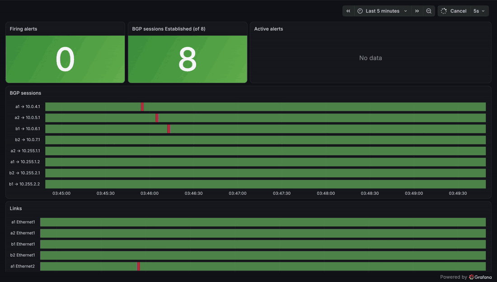
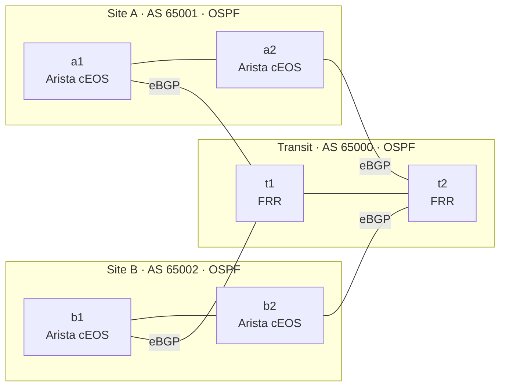
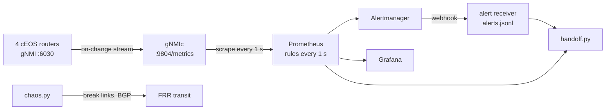

# NetPulse

A 6-router OSPF/BGP lab, defined as code, that watches itself: gNMI telemetry into
Prometheus and Grafana, alerts linked to runbooks, a chaos runner that measures
time-to-alert, and an auto-generated shift-handoff report.


<!--   (uncomment once docs/demo.gif exists) -->

## Results

180 injected failures across three configurations on a MacBook Air (Apple silicon, OrbStack),
2026-09-28. Every failure was detected. See [Method](#method).

| Failure | v1: 2 s sampling | v2a: + on-change streaming | **v2: + BFD** |
| --- | --- | --- | --- |
| Link down | 1.88 s (p95 2.63) | 0.77 s (p95 1.39) | **0.85 s (p95 1.26)** |
| BGP session shutdown | 1.72 s (p95 2.63) | 0.87 s (p95 1.29) | **0.94 s (p95 1.24)** |
| Silent packet loss | 4.34 s (p95 5.65) | 3.39 s (p95 3.90) | **1.02 s (p95 1.57)** |
| **All 60** | **2.33 s (p95 4.89)** | **1.20 s (p95 3.83)** | **0.97 s (p95 1.53)** |

Median time-to-alert (p95 in brackets), 20 runs per cell, 60/60 detected in every configuration.

- **v1 → v2 cut p95 time-to-alert 69% (4.89 s → 1.53 s)** and the worst case from 5.74 s to 1.69 s.
- **On-change streaming** removed the wait for the next 2 s telemetry sample: medians roughly halved.
- **BFD** replaced the 3 s BGP hold timer as the silent-failure detector: silent-loss p95 fell 72%
  (5.65 s → 1.57 s), so a silent failure is now caught about as fast as a cable pull.

Raw data: [`results/v1/`](results/v1), [`results/v2a/`](results/v2a), [`results/v2/`](results/v2).
Sample shift-handoff report written during a live incident: [`docs/sample-handoff.md`](docs/sample-handoff.md).

## Architecture





The transit routers are deliberately unmonitored: in real networks you get no telemetry from your
provider, so their failures have to be detected from your own side. That's what the lab measures.

### Design plan

| Router | Role | NOS | AS | Loopback0 | Mgmt IP |
| --- | --- | --- | --- | --- | --- |
| a1 | Site A edge | Arista cEOS 4.36.2F | 65001 | 10.255.1.1/32 | 172.20.20.11 |
| a2 | Site A edge | Arista cEOS 4.36.2F | 65001 | 10.255.1.2/32 | 172.20.20.12 |
| b1 | Site B edge | Arista cEOS 4.36.2F | 65002 | 10.255.2.1/32 | 172.20.20.21 |
| b2 | Site B edge | Arista cEOS 4.36.2F | 65002 | 10.255.2.2/32 | 172.20.20.22 |
| t1 | Transit | FRR 10.7.1 | 65000 | 10.255.0.1/32 | 172.20.20.31 |
| t2 | Transit | FRR 10.7.1 | 65000 | 10.255.0.2/32 | 172.20.20.32 |

| # | Side A | Side B | Subnet | Runs |
| --- | --- | --- | --- | --- |
| 1 | a1 eth1 .0 | a2 eth1 .1 | 10.0.1.0/31 | OSPF area 0 |
| 2 | b1 eth1 .0 | b2 eth1 .1 | 10.0.2.0/31 | OSPF area 0 |
| 3 | t1 eth3 .0 | t2 eth3 .1 | 10.0.3.0/31 | OSPF area 0 |
| 4 | a1 eth2 .0 | t1 eth1 .1 | 10.0.4.0/31 | eBGP 65001–65000 |
| 5 | a2 eth2 .0 | t2 eth1 .1 | 10.0.5.0/31 | eBGP 65001–65000 |
| 6 | b1 eth2 .0 | t1 eth2 .1 | 10.0.6.0/31 | eBGP 65002–65000 |
| 7 | b2 eth2 .0 | t2 eth2 .1 | 10.0.7.0/31 | eBGP 65002–65000 |

- OSPF inside each site and inside transit carries loopbacks, so iBGP peers loopback-to-loopback
  with `next-hop-self`.
- 7 BGP sessions in total (4 eBGP, 3 iBGP). The four cEOS routers see **8 session endpoints**
  (2 each), which is what the alerts and `chaos.py` check.
- Each site advertises its loopbacks plus a site prefix (192.168.1.0/24, 192.168.2.0/24).

| Setting | v1 | v2 | Why |
| --- | --- | --- | --- |
| BGP keepalive / hold | 1 s / 3 s | 1 s / 3 s | Backstop; 180 s by default |
| BFD on eBGP links | none | 100 ms × 3 | Silent failure detected in ~300 ms instead of the 3 s hold timer |
| OSPF hello / dead (p2p) | 1 s / 4 s | 1 s / 4 s | Fast adjacency loss, no DR election |
| gNMI subscription | sample every 2 s | on-change, 10 s heartbeat | Router pushes a change the moment it happens |
| Prometheus scrape / eval | 2 s / 2 s | 1 s / 1 s | Shorter waits in the pipeline |
| Alert `for:` | 0 s | 0 s | Fire on the first bad sample (lab measurement only) |
| Alertmanager `group_wait` | 0 s | 0 s | The 30 s default would pollute every measurement |

**Latency model:** t_alert = t_detect + Δsample + Δscrape + Δeval + Δnotify.

- v1: each 2 s wait averages ~1 s, so a ~3 s median was predicted when the router notices instantly.
  Measured 1.7–1.9 s: the waits overlap more favourably than the independent-average model assumes.
  Silent loss adds t_detect ≈ 3 s (hold timer): predicted ~5–6 s, measured 4.3 s median, 5.7 s max.
- v2: Δsample ≈ 0 (on-change), Δscrape + Δeval average ~1 s total, t_detect ≈ 0.3 s for silent loss
  (BFD). Measured ~0.9–1.0 s medians for all three failure types.

## Run it

Needs an Apple silicon Mac with OrbStack, an Ubuntu machine with containerlab 0.79, and the
`cEOSarm-lab-4.36.2F` image imported as `ceos:4.36.2F`.

```bash
make deploy          # 6 routers + gNMIc, Prometheus, Alertmanager, Grafana, receiver
open http://localhost:3000   # Grafana, dashboard "NetPulse"
make chaos-smoke     # 2 real failures, sanity check
make chaos           # 60 failures, ~15 min
make handoff         # shift-handoff report from alert history
make test            # ruff + pytest
```

## Method

1. Before each injection the runner waits a random 0–4 s, so failures land at random points in the
   telemetry, scrape and evaluation cycles. (A first run without this was phase-locked: injections
   always followed a Prometheus evaluation, and BGP-shutdown times clustered at 0.80–0.92 s.
   That run is kept, clearly labelled, in [`results/v0-phase-locked/`](results/v0-phase-locked).)
2. `t0` is stamped immediately before the failure is injected; `received_at` is stamped the moment
   the webhook arrives. Both clocks are the same Linux kernel (containers share it), so there is no skew.
3. An alert counts only if it names the exact router plus interface or BGP neighbor that was broken.
4. Timeouts stay in the data as undetected runs.
5. Every run starts from full health: nothing firing and all 8 sessions Established.
6. Raw evidence is committed: `runs.csv` and `summary.json` for every configuration.

## Tests

- `pytest`: percentile math, alert matching, half-written log lines, handoff pairing, and a
  cross-check of every router config against the design plan.
- `promtool test rules`: unit tests for the alert rules themselves.
- `tests/check_topology.py`: the lab file against containerlab's JSON schema.
- `amtool check-config`: the Alertmanager config.

## What I'd do next

Done in v2: on-change telemetry and BFD, each measured against the baseline. Next: a site-internal
failure scenario (a1–a2 link), OSPF adjacency and prefix-count alerts, a transit-side view with
frr_exporter, and Batfish checks on configs in CI.

## License

MIT. Lab-only credentials (admin/admin); never reuse them.
